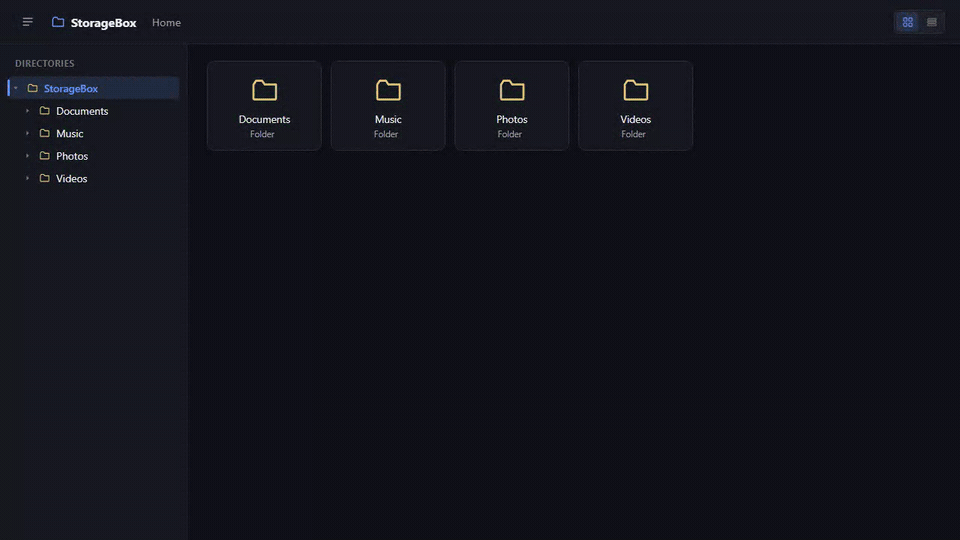
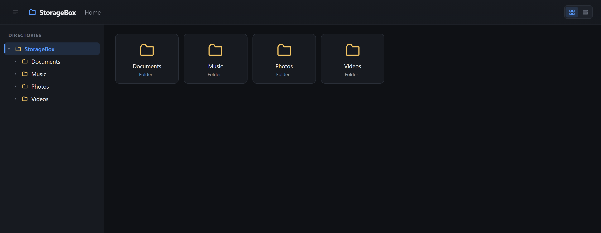
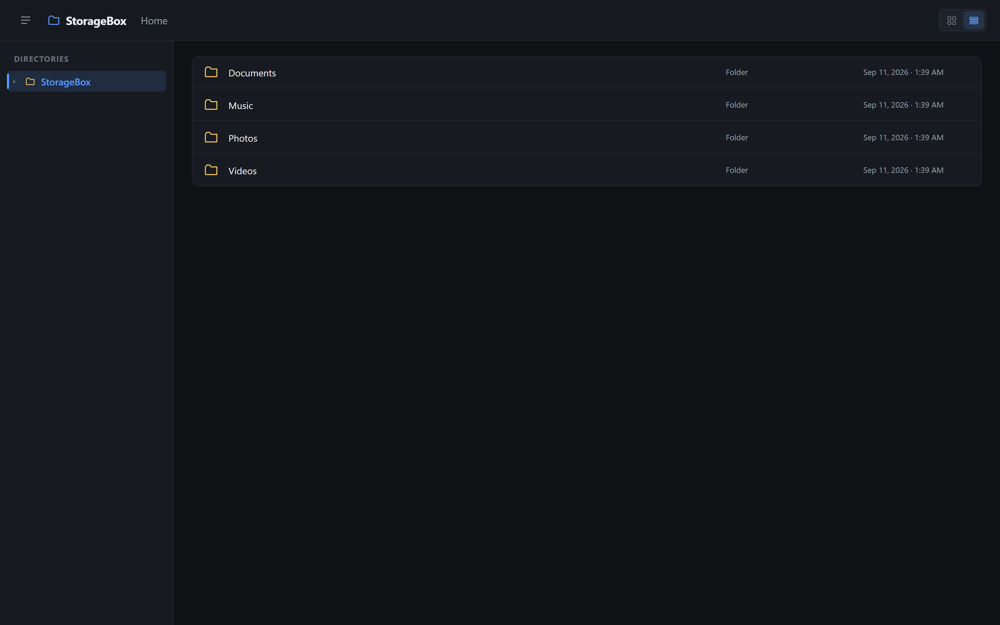
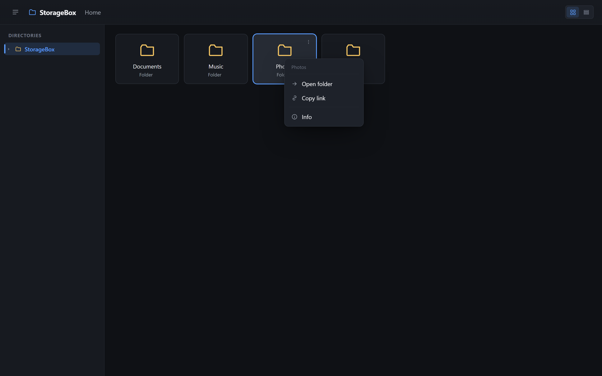
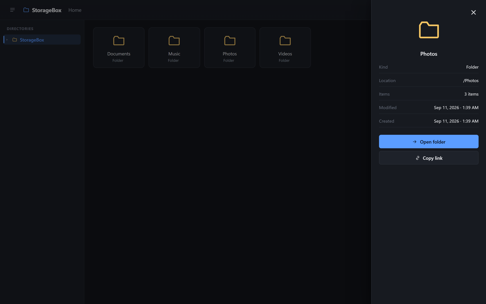
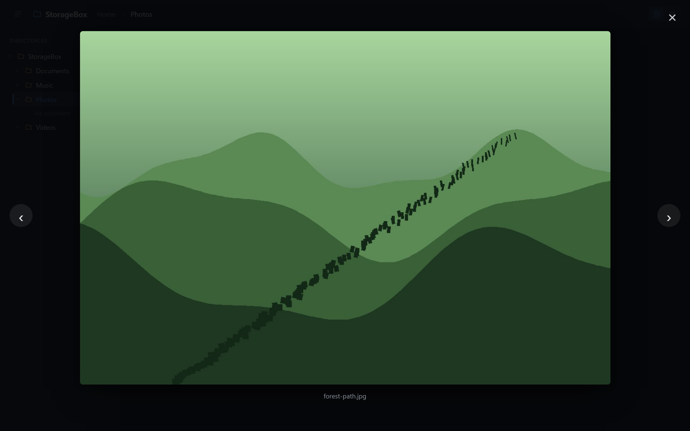
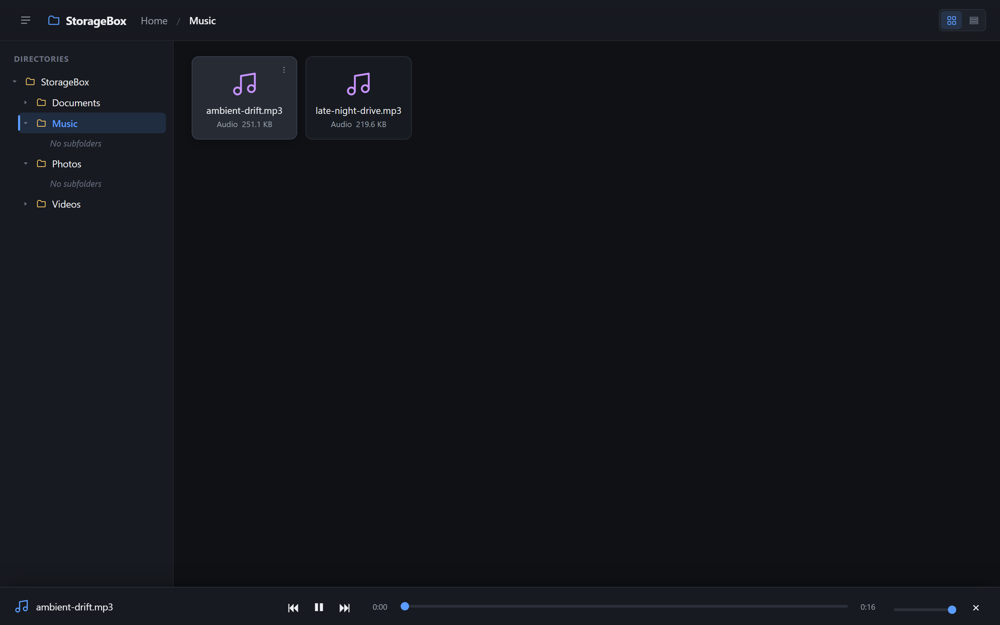
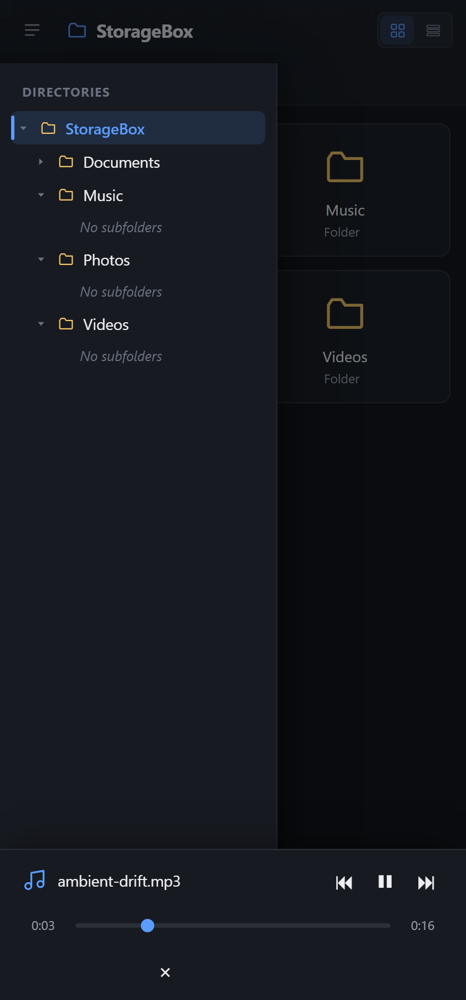

# StorageBox-OpenDirectory

A self-hosted directory browser — like a friendlier `fileserver` or Caddy's `file_server browse`. Point it at a folder via `config.json` and get a modern, animated web UI for browsing it: a two-pane explorer with a directory tree, grid/list views, right-click actions, and full inline preview/playback for images, video, audio, and documents.

There are really two apps in one here, switched with a single config flag: `adminEnabled`.

- **`adminEnabled: false`** (the default) — a plain **OpenDirectory**: anonymous, no login, and always strictly read-only. `allowAnonymousUpload` and `allowWriteAccess` (below) are ignored no matter what they're set to — there's no config combination that produces anonymous write access. It just browses the folder in `root`.
- **`adminEnabled: true`** — a real **storage server**: the first visit forces a one-time wizard to create an admin account, every route requires login after that, and the admin gets a settings GUI (`/admin`) to turn on uploads/write access, add more accounts (admin or restricted "viewer"), and change anything else in `config.json` without hand-editing it. See [Accounts & the admin panel](#accounts--the-admin-panel).



## Features

- **Two-pane explorer** — a collapsible, lazy-loaded directory tree on the left that stays in sync with the file view on the right
- **Grid or list view** — toggle between a card grid and a table-style list; your choice is remembered
- **Right-click context menu** (or the "⋮" button, for touch) — Open, Open in new tab, Download, Copy link, and Info on every entry
- **Info panel** — a slide-in drawer with kind, location, size, item count, and modified/created dates
- **Images** — lightbox viewer with next/prev navigation
- **Video** — inline player, streamed with HTTP range support so seeking works
- **Audio** (mp3, wav, and more) — persistent bottom player with a full playlist of the current folder: play/pause/seek/volume/next/prev
- **Documents** — PDFs open in an inline viewer; text-like files (`.txt`, `.md`, `.json`, `.csv`, `.log`, ...) preview inline; other office docs get a direct open/download link
- Fully responsive, with an off-canvas directory drawer on mobile
- *(requires `adminEnabled: true`)* **Anonymous upload drop-box** — a public "Upload" button that drops files into `/uploads`, with every upload logged (filename + uploader IP)
- *(requires `adminEnabled: true`)* **Read-write mode** — per-folder read-only/read-write rules, an in-browser text/code editor, rename, delete, and a WebDAV mount for using it as a real network drive
- *(requires `adminEnabled: true`)* **Accounts & admin panel** — a first-run wizard forces creating an admin account; the admin can add `viewer` accounts (optionally restricted to specific folders) for other people to log in and browse with, and a built-in settings GUI (`/admin`) lets the admin change every setting above without touching `config.json` by hand

## Screenshots

<table>
<tr>
<td width="50%">

**Grid view**


</td>
<td width="50%">

**List view**


</td>
</tr>
<tr>
<td width="50%">

**Right-click context menu**


</td>
<td width="50%">

**Info panel**


</td>
</tr>
<tr>
<td width="50%">

**Image lightbox**


</td>
<td width="50%">

**Audio player with playlist**


</td>
</tr>
<tr>
<td width="50%">

**Inline video playback**


</td>
<td width="50%">

**Responsive mobile drawer**


</td>
</tr>
</table>

## Setup

```bash
npm install
cp config.example.json config.json
```

Edit `config.json`:

```json
{
  "title": "StorageBox",
  "root": "./shared",
  "host": "0.0.0.0",
  "port": 3000
}
```

- `root` — the directory to share. Relative paths resolve against `config.json`'s location; absolute paths (e.g. `"D:/Media"` or `"/mnt/media"`) work too. On Windows, use forward slashes (`"C:/Users/you/Downloads"`) or doubled backslashes (`"C:\\Users\\you\\Downloads"`) — JSON doesn't allow single backslashes in strings.
- `title` — shown in the header and browser tab.
- `host` / `port` — where the server listens.

`config.json` is gitignored since it's machine-specific (usually pointing outside the repo) — keep `config.example.json` as the template.

## Configuration changes

If you have an existing `config.json` from before accounts/the admin panel existed, two things changed. Both are one-time edits — `config.example.json` already reflects the new shape.

| Flag | What changed |
| --- | --- |
| `openDirectoryMode` → **`adminEnabled`** | Renamed, and **inverted**. The old flag defaulted `true` for "anonymous, no login." The new one defaults `false` for the same thing. If your config had `"openDirectoryMode": false` (login required), change it to `"adminEnabled": true`. If it had `"openDirectoryMode": true` or didn't mention it at all, either remove the line or set `"adminEnabled": false` — same behavior either way. |
| `allowAnonymousUpload`, `allowWriteAccess.enabled` | **Stricter now.** These used to work on their own, with or without accounts — an anonymous, login-free server could still have anonymous uploads or anonymous write access turned on. They no longer do anything by themselves: both are now ignored unless `adminEnabled` is also `true`. If your config already had either of these set to `true` for an anonymous (no-login) server, that upload button / write access will stop appearing until you turn `adminEnabled` on and log in as admin to re-enable them from `/admin` (or leave them set here — they'll just take effect automatically once `adminEnabled` flips on). |

One more thing worth knowing about even though it's not in `config.json`: each **`viewer`** account can now optionally be restricted to specific folders (an `allowedPaths` list, stored per-user in `users.json`). This is new, not a change to an existing flag — it doesn't affect anyone who was already using accounts, since a viewer with no restriction set (the default) still sees everything, exactly as before. Set it per-user from the **Users** table in `/admin` — see [Accounts & the admin panel](#accounts--the-admin-panel).

## Uploads, write access & WebDAV

Everything in this section requires `adminEnabled: true` — with it `false` (the default), the server rejects every `POST`/`PUT`/`DELETE`/`PATCH` request at the engine level (`server/index.js`) unconditionally, so a stock `config.json` is a strictly read-only OpenDirectory no matter what `allowAnonymousUpload`/`allowWriteAccess` say. With `adminEnabled: true`, those two flags (settable here in `config.json`, or from `/admin`) each independently open one more route.

### Anonymous upload drop-box

```json
{
  "allowAnonymousUpload": true
}
```

When enabled:
- A public **Upload** button appears in the top bar. It's hidden entirely when this is off.
- Uploaded files always land in a fixed `uploads/` folder inside `root` (created automatically) — never wherever the visitor happens to be browsing.
- Every upload is appended to `log_anonymous.log` (next to `config.json`, not inside `root`, so it's never itself browsable) as `<timestamp>  <IP>  <filename>`.
- Files are capped at 500MB each, 20 per request, and given a safe on-disk name (no path traversal via filename).

### Read-write mode

```json
{
  "allowWriteAccess": {
    "enabled": true,
    "webdav": false,
    "defaultMode": "read-only",
    "rules": [
      { "path": "incoming", "mode": "read-write" }
    ]
  }
}
```

- `enabled` — turns write access on, but only takes effect when `adminEnabled` is also `true`; off (default), or with `adminEnabled: false`, every path is read-only regardless.
- `defaultMode` — `"read-only"` or `"read-write"`, applied to any path not matched by `rules`.
- `rules` — per-folder overrides, most-specific path wins. In the example above, everything is read-only *except* `incoming/` (and its subfolders), which allows edits, renames, and deletes. Flip `defaultMode` to `"read-write"` and add a `read-only` rule instead if you'd rather share-with-a-few-locked-folders than lock-with-a-few-open-folders.
- Every write request is re-checked against these rules server-side (`server/access.js`, `server/routes/fs.js`) — the UI only uses them to decide what buttons to show.

What unlocks in a writable folder:
- **Edit** — a right-click/info-panel action that opens a built-in [CodeMirror](https://codemirror.net/) editor for plain text, Markdown, and common code/config files (`.txt`, `.md`, `.json`, `.js`, `.css`, `.py`, `.yml`, `.env`, ...), with syntax highlighting and a Save button.
- **Rename** and **Delete** — also from the right-click menu or info panel. Delete removes folders recursively, so it always asks for confirmation first.

Only an `admin` account can actually use any of this — a `viewer` account never can, even in a folder marked read-write (see [Accounts & the admin panel](#accounts--the-admin-panel)).

`webdav: true` additionally mounts a [WebDAV](http://www.webdav.org/specs/rfc4918.html) server at `/webdav`, honoring the exact same per-path rules — so a read-only path via the web UI is also read-only over WebDAV, and vice versa. This lets you mount the share as a real network drive:
- **Windows**: File Explorer → *This PC* → *Map network drive* → `http://<host>:<port>/webdav/`
- **macOS**: Finder → *Go* → *Connect to Server* → `http://<host>:<port>/webdav/`
- **Linux**: `davfs2`, or your file manager's "Connect to Server" (GVfs supports `dav://`)

WebDAV is opt-in on top of `enabled` because it exposes the whole mounted folder (including dotfiles, which the browser UI hides) to any WebDAV client — enable it only if you actually want disk-style mounting.

## Accounts & the admin panel

This is the one flag that decides which of the two apps described at the top you're running:

```json
{
  "adminEnabled": false
}
```

- **`false` (default)** — plain OpenDirectory. No login, no accounts, always read-only, exactly as if none of the rest of this README existed.
- **`true`** — storage-server mode:
  1. **First visit** — since no account exists yet, `/login` shows a "Create the admin account" form instead of a sign-in form. Whoever fills it in becomes the first `admin`.
  2. **Every route after that** — `/api/list`, `/files`, `/download`, `/api/fs`, `/webdav`, everything — requires a logged-in session, and an unauthenticated visit is redirected to `/login`.
  3. **The admin** can then open the user menu (top-right, once logged in) → **Admin settings**, or go straight to `/admin`, to configure everything else:

     - **Settings** — `title`, `adminEnabled` itself, `allowAnonymousUpload`, and every `allowWriteAccess` field (including the per-folder rules list), all from a form. Changes save to `config.json` and take effect immediately, no restart needed. (`root`, `host`, and `port` are shown for reference but stay file-only, since they're only read once at process start.)
     - **Users** — create more accounts, each either:
       - **`admin`** — full access: same permissions as whoever ran setup, plus the admin panel itself and WebDAV.
       - **`viewer`** — browse and preview only. A viewer can never write, rename, delete, or use the editor, no matter what `allowWriteAccess` says, and never gets WebDAV access either (see below) — only an admin can do either.
     - **What a viewer can see** — by default a new viewer can browse the whole shared folder, same as an admin. Giving them a comma-separated **"Visible folders"** list (at creation, or later via **Edit access**) restricts them to just those folders and their subfolders — everything else 404s for them, both in listings and if they guess a direct `/files/...` URL. Changes to a user's visible folders take effect on their very next request, without needing to log in again.

     Reset a user's password or delete their account from the same table (an admin can't delete the one they're currently logged in as, and the last remaining admin account can't be deleted at all).

Passwords are hashed with bcrypt; sessions are cookie-based (`express-session`) with a random secret generated once into `session-secret.txt` next to `config.json`. Accounts (including each viewer's visible-folders list) live in `users.json`, also next to `config.json` — both files are gitignored, just like `config.json` itself. Login attempts are throttled (10 tries per 15 minutes per IP+username) to blunt brute-forcing.

Turning `adminEnabled` off from the admin panel warns you before saving: it removes the login requirement and forces the server back to plain read-only OpenDirectory immediately for everyone — except the admin session that just made the change, which stays logged in and keeps access to `/admin` (so you can always flip it back on without editing `config.json` by hand).

## Run

```bash
npm start        # production
npm run dev       # auto-restarts on server code changes (node --watch)
```

Then open `http://localhost:3000` (or whatever `host`/`port` you set).

## How it works

- `server/` — Express app:
  - `/api/list/*` walks the configured root (with path-traversal protection) and returns JSON directory listings, each entry annotated with `writable: true/false`.
  - `/api/info/*` returns metadata for a single file or folder (size/item count, created/modified dates, `writable`) for the info panel.
  - `/files/*` serves file bytes read-only via `express.static` (range requests included, which is what makes audio/video scrubbing work).
  - `/download/*` serves the same bytes with `Content-Disposition: attachment` so the context menu's "Download" always saves instead of opening inline.
  - `/api/upload` *(mounted always, but 404s unless `allowAnonymousUpload` is effectively on — see `uploadsEnabled()` in `server/access.js`)* — accepts multipart uploads into `uploads/` and logs them.
  - `/api/fs/*` *(mounted always, same live-checked pattern via `writeAccessEnabled()`)* — `PUT` writes/creates a file, `DELETE` removes a file or folder, `PATCH` renames within its own folder; every call re-checks `server/access.js` (per-path rule *and* that the caller is an `admin`) before touching disk.
  - `/webdav` *(same pattern via `webdavEnabled()`, and admin-only — see below)* — a [`webdav-server`](https://www.npmjs.com/package/webdav-server)-backed mount over the same root, gated by a privilege manager that consults the same per-path rules.
  - `/api/auth/*` (status/setup/login/logout) and `/api/admin/*` (settings + user management, admin-only) back accounts/the admin panel — see `server/routes/auth.js`, `server/routes/admin.js`, `server/users.js`.
  - `server/access.js` is the single source of truth for what's currently allowed: `uploadsEnabled()`, `writeAccessEnabled()`, and `webdavEnabled()` all fold in `adminEnabled` (so turning it off forces every one of them off, regardless of their own config values), `canUserWrite()` additionally requires an `admin` role, and `canUserSee()`/`canUserReach()` enforce a viewer's optional `allowedPaths` restriction.
  - A single engine-level middleware rejects every write HTTP method (`POST`/`PUT`/`DELETE`/`PATCH`) by default, before any router runs; a separate `requireAuth` gate sits in front of every data route and is a no-op whenever `adminEnabled` is `false` — see the comment blocks at the top of `server/index.js`.
  - Settings changed from `/admin` are written straight to `config.json` and applied to the running server via one mutable, in-place-updated `config` object (and a rebuildable `accessResolver` for write-access rules) — nothing here needs a restart except `root`/`host`/`port`.
- `public/` — a vanilla JS single-page app: a lazy-loaded directory tree in the sidebar, a grid/list file view, a right-click context menu, a sliding info panel, the lightbox/video/audio/doc preview UIs, an Edit/Rename/Delete flow with a lazily-loaded CodeMirror editor, and (when `adminEnabled` is on) a login page, a user menu, and an admin settings page — all wired to the API above, with browser back/forward handled via `history.pushState`.

## Security notes

- All listing and file routes resolve paths against the configured root and reject any request that would escape it (`../` traversal, absolute paths, symlink tricks via normal path resolution).
- Dotfiles (`.env`, `.git`, etc.) are excluded from directory listings, file serving, and the write API — though a WebDAV mount, if enabled, does expose them (see above).
- **Read-only, and login-free, by default — no exceptions.** With `adminEnabled: false`, write HTTP methods are refused at the server level unconditionally, regardless of `allowAnonymousUpload`/`allowWriteAccess`; there's no config combination that produces anonymous write access. Every data route requires a session once `adminEnabled` is `true`. In every case the actual guard runs server-side on every request; the UI hiding a button or redirecting to `/login` is just a convenience.
- A **viewer** account can never write, rename, delete, or edit — regardless of what `allowWriteAccess` rules say — only an **admin** account can, and only an admin can use WebDAV at all. This is enforced in the same server-side checks as everything else (`server/access.js`'s `canUserWrite`), not just hidden in the UI.
- A viewer's optional **visible-folders** restriction (`allowedPaths` in `users.json`) is enforced server-side too, for listings and for direct `/files`/`/download`/`/api/info` requests alike — guessing a URL outside their allowed folders 404s the same as it not existing.
- Session cookies are `httpOnly`; the session secret is generated once into `session-secret.txt` and reused across restarts. There's no HTTPS built in — if you expose the admin-enabled server beyond a trusted LAN, put it behind a reverse proxy (Caddy, nginx) that terminates TLS, so login credentials and session cookies aren't sent in the clear.
- If you enable uploads or write access on a server reachable by untrusted users, treat it like any other write-capable fileserver: restrict it to a trusted network, and keep an eye on `log_anonymous.log`.
